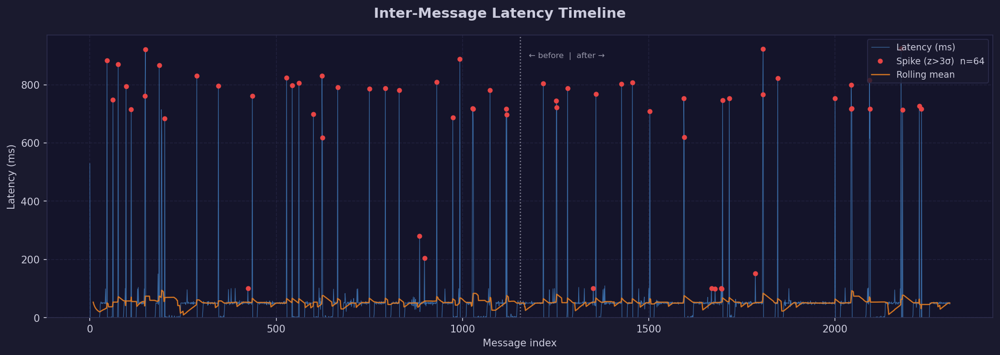
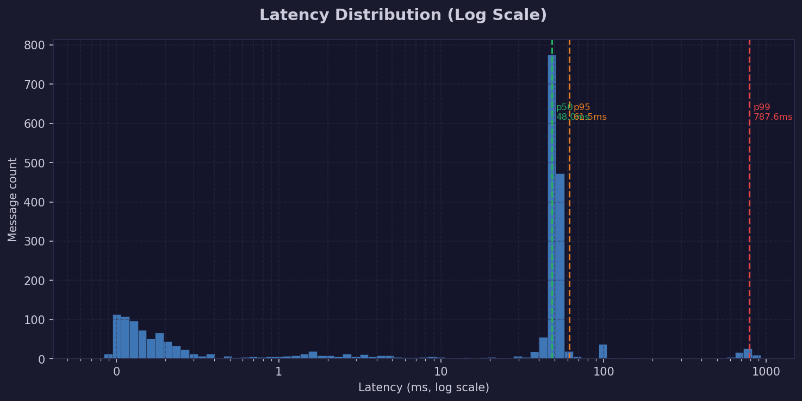
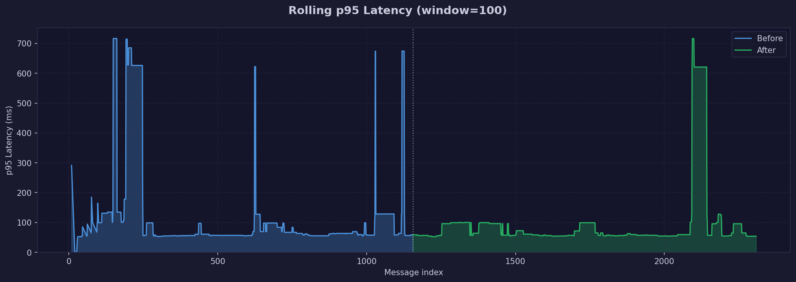
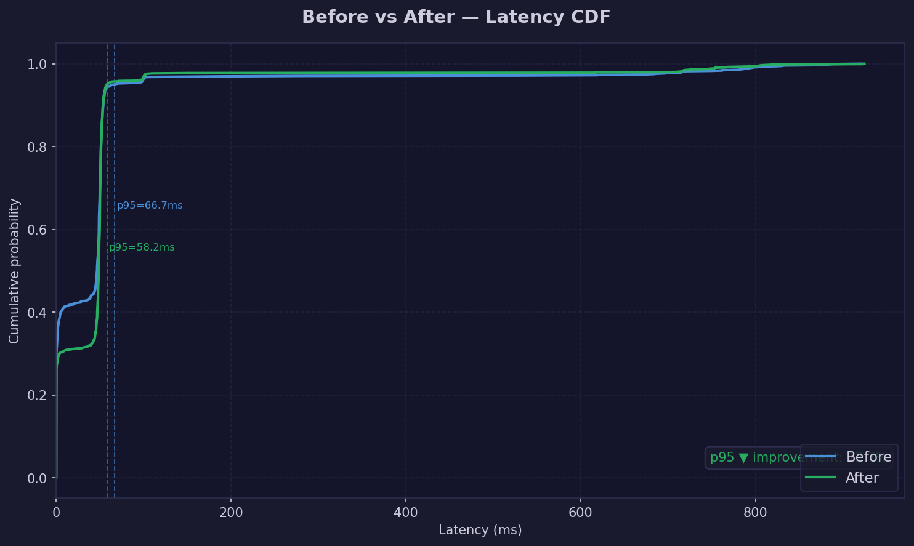

# Market Latency Profiler

A Python toolkit for collecting, analyzing, and visualizing real-time market data latency from the Coinbase Advanced Trade WebSocket feed.

Built to answer the same question low-latency trading firms ask every day: **how does a system actually behave in production, and how do we prove that a change made it better?**

---

## Results (Live BTC-USD Data — April 2026)

| Metric | Before | After | Change |
|--------|--------|-------|--------|
| Mean | 51.43 ms | 51.56 ms | — |
| p50 | 46.86 ms | 48.90 ms | — |
| **p95** | **66.70 ms** | **58.20 ms** | **▼ 12.7% improvement** |
| **p99** | **794.95 ms** | **753.75 ms** | **▼ 5.2% improvement** |
| Spike rate | 2.86% | 2.69% | ▼ 6.0% reduction |

**Statistical significance:** Mann-Whitney U = 625,528 — p = 0.0107 ✓ (significant at α = 0.05)

> 2,309 real messages collected from Coinbase BTC-USD L2 order book feed. 64 anomalous spikes detected via rolling z-score.

---

## Charts

### Latency Timeline with Anomaly Detection


### Distribution (Log Scale) with p50 / p95 / p99 Markers


### Rolling p95 — Before vs After


### Cumulative Distribution Function Comparison


---

## What it does

| Step | Script | What happens |
|------|--------|--------------|
| 1 | `collector.py` | Connects to Coinbase WebSocket, streams BTC-USD L2 order book updates, records millisecond-resolution arrival timestamps |
| 2 | `analyzer.py` | Computes inter-message latency, runs rolling z-score spike detection, splits data into before/after phases |
| 3 | `visualizer.py` | Generates 4 publication-ready charts |
| 4 | `experiment.py` | Runs Mann-Whitney U significance test, computes p95/p99 deltas, exports structured markdown report |

---

## Quickstart
```bash
git clone https://github.com/AdityaVenkata/market-latency-profiler
cd market-latency-profiler
pip install -r requirements.txt
python collector.py --duration 120
python analyzer.py
python visualizer.py
python experiment.py
```

---

## Methodology

### Latency definition
Inter-message latency = wall-clock time between consecutive WebSocket message arrivals at the local client. Captures combined network transit time + exchange processing delay.

### Anomaly detection — Rolling Z-Score

